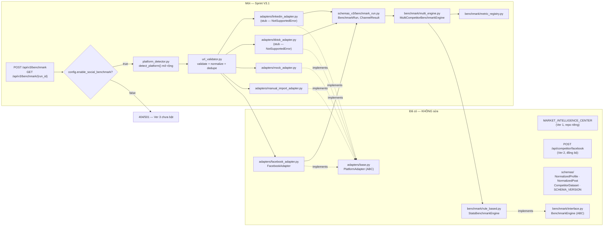
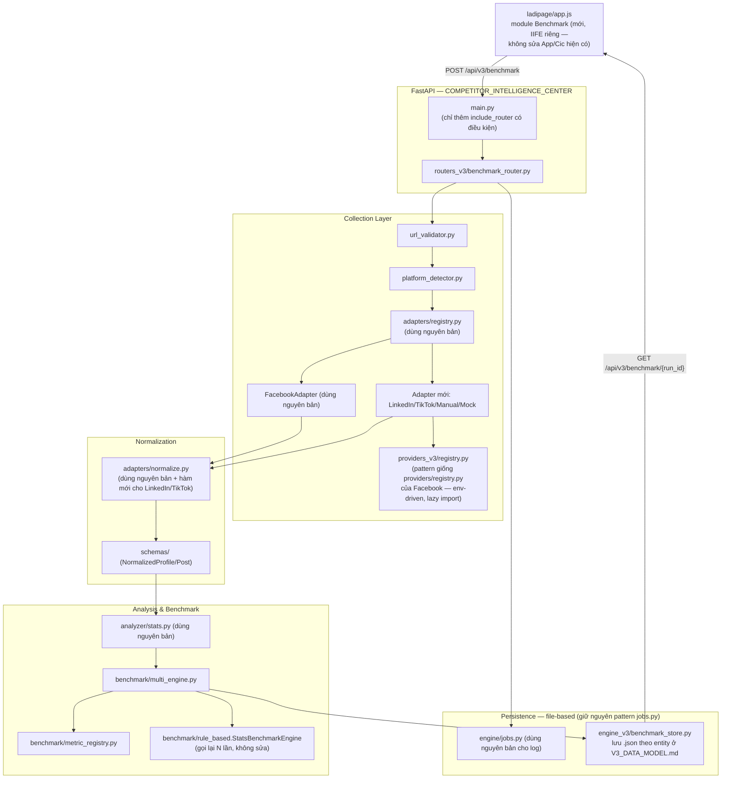
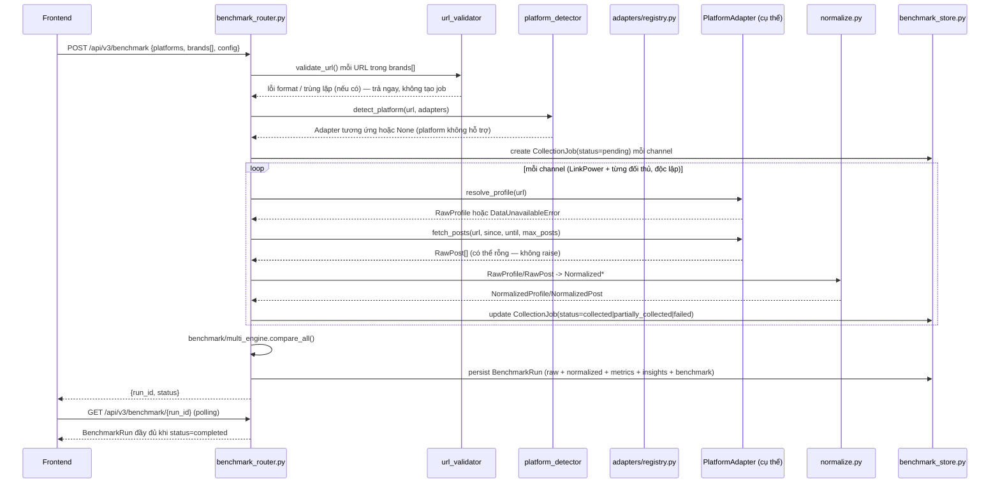
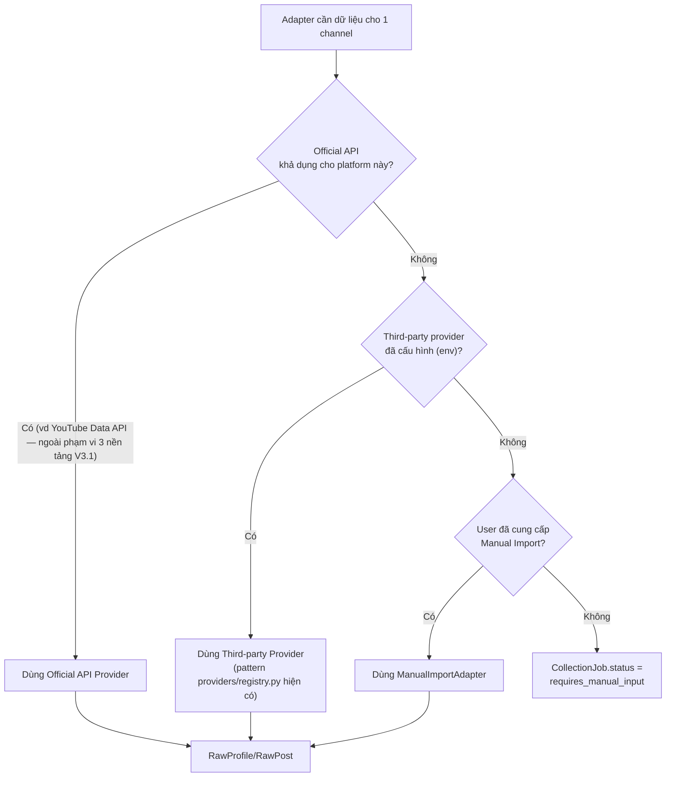
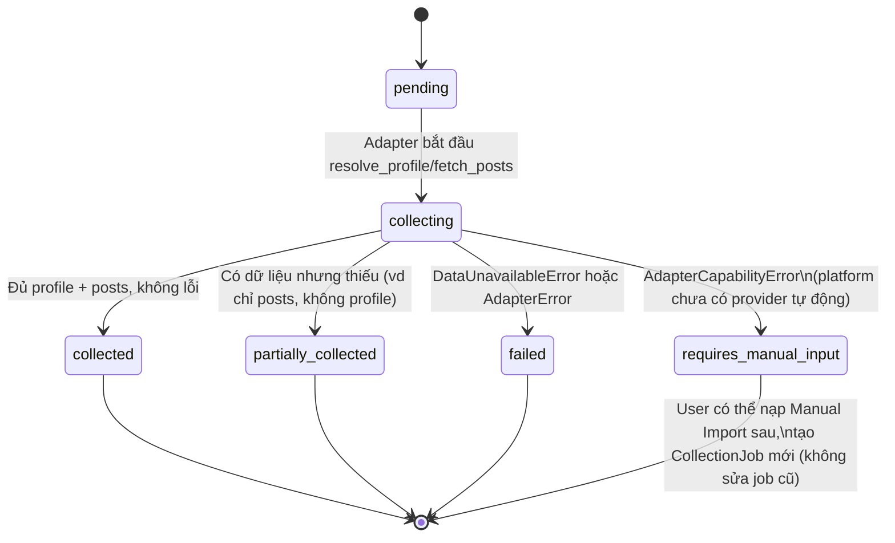

# V3_ARCHITECTURE.md — Social Competitor Benchmark (Sprint V3.1)

> Kế thừa trực tiếp `ARCHITECTURE.md` (Sprint 1 của Ver 2) — không thay thế,
> chỉ mở rộng. Mọi quyết định ở đây tôn trọng 2 hợp đồng đã khoá của Ver 2:
> `PlatformAdapter` (adapters/base.py) và `NormalizedProfile`/`NormalizedPost`
> (schemas/). Xem lý do trong `V3_CURRENT_SYSTEM_AUDIT.md` §11.

## 1. Architecture Overview

Ver 3 thêm 3 khả năng mới lên trên nền Ver 2 mà **không sửa** file nào đã
khoá kiến trúc (`adapters/base.py`, `schemas/enums.py`, `schemas/profile.py`,
`schemas/post.py`, `benchmark/interface.py`):

1. **Đa nền tảng thật**: thêm `LinkedInAdapter`, `TikTokAdapter` (contract +
   mock/manual-import ở Sprint này, provider thật ở V3.2+), song song với
   `FacebookAdapter` đã có.
2. **Đa đối thủ**: 1 entity mới `BenchmarkRun` bọc ngoài `CompetitorDataset`
   hiện có — gọi lại `StatsBenchmarkEngine.compare()` (không sửa) N lần
   (LinkPower vs từng đối thủ) rồi tổng hợp thành "so với cả nhóm".
3. **Feature flag + route riêng**: toàn bộ API mới nằm dưới `/api/v3/*`,
   tắt qua `config.json.enable_social_benchmark` (mặc định `false`), không
   đụng `/api/competitor/facebook` hay bất kỳ route Ver 1/Ver 2 nào.



## 2. Component Diagram



## 3. Data Flow (đúng theo pipeline yêu cầu ở đề bài Mục 7)

```mermaid
flowchart LR
    A["User Input\n(brands + URLs + config)"] --> B["URL Validation\nurl_validator.py"]
    B --> C["Platform Detection\nplatform_detector.py"]
    C --> D["Collection Job\nCollectionJob per channel\nstatus lifecycle §6"]
    D --> E["Platform Adapter\nFacebook (thật) /\nLinkedIn·TikTok (mock/manual ở V3.1)"]
    E --> F["Raw Data Storage\nraw_social_items (RawProfile/RawPost dạng JSON)"]
    F --> G["Normalization\nadapters/normalize.py\n-> NormalizedProfile/NormalizedPost"]
    G --> H["Metrics Calculation\nanalyzer/stats.py + benchmark/metric_registry.py"]
    H --> I["AI Content Classification\nanalyzer/ (tái dùng AnalysisEngine\ncho phần định tính mỗi kênh)"]
    I --> J["Benchmark Engine\nbenchmark/multi_engine.py\n(gọi StatsBenchmarkEngine N lần)"]
    J --> K["Insight Generation\nai_insights (tổng hợp AI, không tính lại số)"]
    K --> L["Report Storage\nreports_v3/{run_id}/*.json"]
    L --> M["Dashboard API\nGET /api/v3/benchmark/{run_id}"]
    M --> N["Frontend Dashboard\nladipage Benchmark module"]
```



## 4. Collection Pipeline — chi tiết theo channel



Nguyên tắc **"1 URL lỗi không sập cả job"** áp dụng đúng như
`ARCHITECTURE.md` §2.5 của Ver 2 (đã kiểm chứng bằng code thật ở
`engine/pipeline.py._collect_profile_with_posts(required=False)`): mỗi
channel trong `loop` ở trên là 1 `try/except` độc lập, lỗi 1 channel chỉ ghi
`status=failed` cho channel đó, không raise ra ngoài loop.

## 5. Adapter Interface & Provider Fallback Strategy

`PlatformAdapter` (đã khoá — xem `adapters/base.py`) **không đổi**. Ver 3
thêm 4 class mới implement đúng interface này:

| Adapter | detect() | resolve_profile()/fetch_posts() | Vai trò Sprint V3.1 |
|---|---|---|---|
| `FacebookAdapter` | domain facebook.com/fb.com/fb.watch | Gọi Apify thật (đã có) | Không đổi |
| `LinkedInAdapter` | domain linkedin.com (company/school/showcase) | Ném `AdapterCapabilityError` (subclass `AdapterError`, khác `DataUnavailableError`) nói rõ "LinkedIn chưa hỗ trợ thu thập tự động ở Sprint này — dùng Manual Import" | Contract only |
| `TikTokAdapter` | domain tiktok.com (profile) | Tương tự `LinkedInAdapter` | Contract only |
| `ManualImportAdapter` | không tự detect qua URL — được gán tường minh khi user chọn "Nhập thủ công" | Đọc `RawProfile`/`RawPost` từ JSON/CSV người dùng tải lên, validate schema, KHÔNG network I/O | Fallback cho mọi platform khi provider tự động không khả dụng |
| `MockAdapter` | detect luôn `False` trong production (chỉ dùng khi test/dev truyền tường minh) | Trả dữ liệu cố định từ `tests/fixtures/` | Dev/test, chứng minh pipeline chạy đúng không cần provider thật |

**Provider fallback strategy** (áp dụng khi Sprint V3.2+ thêm provider thật
cho LinkedIn/TikTok, thiết kế sẵn khung ở Sprint này):



Quan trọng — **không tự động fallback ngầm giữa các provider trong 1 lần
chạy** (giữ đúng nguyên tắc đã có ở `providers/registry.py` Facebook:
"Không tự động fallback từ Apify sang Playwright"). Thứ tự trên là thứ tự
**cấu hình** (mỗi platform chọn 1 provider cố định qua env, giống
`FACEBOOK_PROVIDER`), không phải retry-chain tự động trong runtime.

## 6. Job Status Lifecycle



6 trạng thái đúng theo yêu cầu đề bài Bước 5 (Pending/Collecting/Collected/
Partially collected/Failed/Requires manual input — map 1-1 vào enum
`CollectionStatus`, xem `V3_DATA_MODEL.md`).

## 7. Retry Strategy

- **Adapter-level**: mỗi provider thật (khi triển khai ở V3.2+) tự chịu
  trách nhiệm retry nội bộ (timeout/rate-limit) theo đúng pattern
  `ApifyFacebookExtractor` hiện có (timeout cấu hình qua env, không retry
  vô hạn). Adapter Sprint V3.1 (stub/mock/manual) không cần retry vì không
  gọi mạng.
- **AI-level**: tái dùng nguyên bản chiến lược đã có ở
  `engine/pipeline._analyze_with_retry_and_fallback` — tối đa 1 retry khi
  AI trả HTML sai định dạng, sau đó fallback rule-based-only. Áp dụng cho
  phần AI Content Classification/Insight Generation của mỗi channel.
- **Không retry ở tầng orchestrator cho lỗi thu thập dữ liệu** (channel lỗi
  → đánh dấu `failed`/`requires_manual_input` ngay, không tự động thử lại
  toàn bộ job) — tránh nhân chi phí provider lên nhiều lần ngoài kiểm soát.

## 8. Error Handling

| Loại lỗi | Exception | Xử lý ở router |
|---|---|---|
| URL sai định dạng/domain không hỗ trợ | `InvalidUrlError` (mới, `url_validator.py`) | 400, không tạo job |
| URL trùng trong cùng request | `DuplicateChannelError` (mới) | 400, liệt kê URL trùng |
| Platform nhận diện được nhưng chưa có Adapter thật | `AdapterCapabilityError` (mới, subclass `AdapterError`) | Không phải lỗi HTTP toàn cục — set `CollectionJob.status = requires_manual_input` cho riêng channel đó, job khác tiếp tục |
| Trang/kênh không tồn tại hoặc private | `DataUnavailableError` (đã có) | Channel đó `status = failed`, job khác tiếp tục |
| Lỗi hệ thống không lường trước (1 channel) | `Exception` bắt ở boundary loop | Channel đó `status = failed`, log `exception`, job khác tiếp tục |
| Toàn bộ request thiếu cấu hình bắt buộc (vd thiếu LinkPower channel) | `HTTPException(400)` | Không tạo job nào |

Nguyên tắc bất biến kế thừa từ Ver 2: **không bao giờ để 1 lỗi channel làm
sập toàn bộ response** — request-level `HTTPException` chỉ dùng cho lỗi xảy
ra *trước khi* bắt đầu vòng lặp thu thập (validate input).

## 9. Logging

Tái dùng logger `logging.getLogger("cic.v3")` cùng format đã cấu hình ở
`main.py` (`%(asctime)s %(levelname)s %(name)s %(message)s`). Log tối thiểu
mỗi channel: `channel_collection_start`, `channel_collection_done
status=<>`, `benchmark_run_completed run_id=<> channels=<>`. Không thêm
log aggregation bên thứ 3 ở Sprint này (đúng Nguyên tắc 7 — không thêm hạ
tầng khi chưa cần).

## 10. Data Persistence (Sprint V3.1 — vẫn file-based, có thiết kế sẵn đường lên DB)

Giữ nguyên triết lý file-based đã chứng minh ở Ver 1/Ver 2 (Nguyên tắc 7:
không thêm DB khi chưa cần). Mỗi `BenchmarkRun` lưu thành 1 thư mục:

```
reports_v3/{run_id}/
  run.meta.json           # trạng thái tổng, giống *.meta.json hiện có
  channels/{channel_id}/
    raw.json                # RawProfile/RawPost thô — audit
    normalized.json          # NormalizedProfile/NormalizedPost[]
  metrics.json             # metric_results (§ V3_BENCHMARK_SPEC.md)
  benchmark.json            # benchmark_results (LinkPower vs từng đối thủ + vs nhóm)
  insights.json              # ai_insights
  report.json                 # bản tổng hợp cuối — dashboard đọc file này
```

Cấu trúc thư mục này **map trực tiếp 1-1** vào các bảng đề xuất ở
`V3_DATA_MODEL.md` (`collection_jobs`, `raw_social_items`,
`normalized_social_items`, `metric_results`, `benchmark_results`,
`ai_insights`, `reports`) — khi Ver 4 hoặc quy mô sử dụng đòi hỏi query
phức tạp hơn, migration sang SQLite/Postgres chỉ là đổi tầng lưu trữ, không
đổi entity/field nào đã thiết kế.

## 11. Integration với Ver 1 và Ver 2

- **Không import chéo code** giữa `MARKET_INTELLIGENCE_CENTER` và
  `COMPETITOR_INTELLIGENCE_CENTER` (đúng quyết định đã có từ Sprint 1 của
  Ver 2 — 2 repo độc lập).
- Trong `COMPETITOR_INTELLIGENCE_CENTER`, Ver 3 **chỉ thêm file mới** +
  1 dòng `include_router` có điều kiện trong `main.py` (bọc bởi feature
  flag) — không sửa `adapters/facebook_adapter.py`,
  `engine/pipeline.py.run_facebook_analysis`, hay bất kỳ route hiện có.
- Frontend: thêm 1 IIFE module `Benchmark` mới trong `ladipage/app.js`,
  đúng pattern `App`/`Cic` đã có (độc lập state, độc lập API base URL nếu
  cần, cùng chia sẻ `Utils`/`ICONS`/CSS class).

## 12. Integration point cho Ver 4

Ver 4 (Marketing Direction, ngoài phạm vi Sprint này) cần tổng hợp Ver 1 +
Ver 2 + Ver 3 mà **không phân tích lại từ đầu**. Ver 3 chuẩn bị sẵn:

- `reports_v3/{run_id}/report.json` là **input trực tiếp** cho Ver 4 (đọc
  file, không gọi lại Adapter/AI) — đúng field `metric_results`,
  `benchmark_results`, `ai_insights` tách biệt để Ver 4 chọn lọc phần cần
  dùng.
- `research_project_id` (xem `V3_DATA_MODEL.md`) là khoá tương lai để Ver 4
  join dữ liệu Ver 1 (`reports/{job_id}.json` của MIC) + Ver 2
  (`reports/{job_id}.json` của CIC) + Ver 3 (`reports_v3/{run_id}/`) theo
  cùng 1 "dự án nghiên cứu" nếu sau này có tầng điều phối chung — Sprint
  V3.1 chỉ đặt tên trường nhất quán, chưa xây tầng điều phối đó.

## 13. Điều không làm ở Sprint V3.1 (khớp đề bài Mục 8)

- Không viết scraper LinkedIn/TikTok thật production.
- Không thêm database.
- Không đổi endpoint/contract Ver 1, Ver 2.
- Không thiết kế UI hoàn chỉnh (chỉ wireframe/skeleton — xem Task 8).
