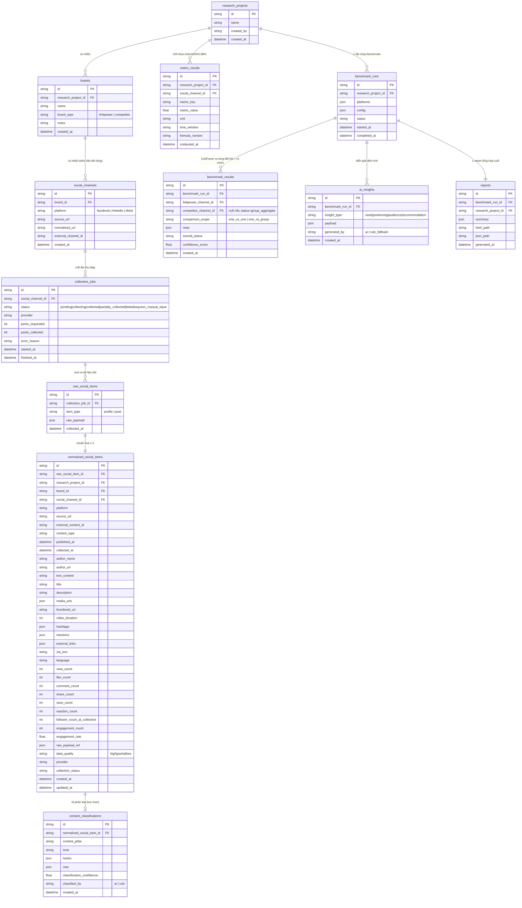

# V3_DATA_MODEL.md — Social Competitor Benchmark (Sprint V3.1)

> Sprint V3.1 **không thêm database** (Nguyên tắc 7 + `V3_ARCHITECTURE.md` §10)
> — mọi entity dưới đây được lưu **file-based** (`reports_v3/{run_id}/*.json`),
> nhưng đặt tên field/quan hệ đúng như thể đã có DB, để migration sau này
> (SQLite/Postgres) chỉ là đổi tầng lưu trữ, không đổi field.

## 1. Entity Relationship

## 2. Đối chiếu với `schemas/` hiện có (Ver 2)

`normalized_social_items` **không thay thế** `NormalizedProfile`/
`NormalizedPost` (Pydantic, đã khoá) — nó là **hình chiếu lưu trữ** của 2
model đó cộng thêm field bối cảnh (`project_id`, `brand_id`, `channel_id`,
`provider`, `collection_status`) mà `NormalizedPost` hiện tại không có
(vì Ver 2 chỉ cần 1-vs-1, không cần định danh brand/project). Bảng đối
chiếu tên field (Đề bài Mục 5 cho phép đổi tên nếu khớp convention hiện tại):

| Field đề bài | Field trong `schemas/` hiện có | Ghi chú |
|---|---|---|
| `id` | — (chưa có, `NormalizedPost` dùng `post_id`) | `normalized_social_items.id` = UUID lưu trữ mới; `external_content_id` = `post_id` gốc |
| `platform` | `NormalizedPost.platform` (`Platform` enum) | Giữ nguyên enum, đã có `LINKEDIN`/`TIKTOK` |
| `source_url` | `NormalizedProfile.source_url` | Ở cấp post dùng `permalink` — map `source_url` (bảng đề bài) → `permalink` (schema hiện có) |
| `content_type` | `NormalizedPost.type` (`PostType` enum) | Giữ nguyên |
| `published_at` | `NormalizedPost.published_at` | Giữ nguyên |
| `text_content` | `NormalizedPost.caption_text` | Giữ tên hiện có, không đổi |
| `media_urls` | `NormalizedPost.media_urls` | Giữ nguyên |
| `hashtags` | `NormalizedPost.hashtags` | Giữ nguyên |
| `view/like/comment/share_count` | `NormalizedPost.engagement.{views,likes,comments,shares}` | Bảng lưu trữ **làm phẳng** (flatten) để dễ query/index; nguồn sự thật vẫn là `EngagementMetrics` |
| `save_count`, `reaction_count`, `mentions`, `external_links`, `cta_text` | **Chưa có trong schema hiện tại** | Field optional mới — thêm vào `NormalizedPost` là thay đổi **không phá vỡ** (optional, không bump `SCHEMA_VERSION` theo đúng quy tắc `ARCHITECTURE.md` §6 của Ver 2) khi có nhu cầu thật; Sprint V3.1 chỉ để `null` trong storage layer, chưa sửa Pydantic model |
| `follower_count_at_collection` | `NormalizedProfile.follower_count` (tại thời điểm collect) | Snapshot — lưu riêng ở cấp post để không phải join lại profile khi tính engagement_rate |
| `engagement_rate` | Chưa có sẵn — tính ở `metric_results`/`benchmark/metric_registry.py` | Xem `V3_BENCHMARK_SPEC.md` |
| `data_quality` | `NormalizedProfile.profile_data_confidence` / `NormalizedPost.engagement_confidence` | Bảng lưu trữ gộp thành 1 field tổng quát cho dễ lọc; chi tiết vẫn giữ 2 field gốc trong `raw_payload_ref` |
| `provider` | Không có trong schema (chỉ có ở `ExtractionStatus`, cấp Facebook-specific) | Field mới ở tầng lưu trữ — ghi provider nào tạo ra bản ghi (`apify`, `manual_import`, `mock`) |
| `collection_status` | `CollectionJob.status` (entity mới) | Copy tại thời điểm tạo bản ghi, phục vụ query không cần join |

**Nguyên tắc**: `schemas/` (Pydantic, trong bộ nhớ, dùng cho pipeline) và
`normalized_social_items` (JSON trên đĩa, dùng cho lưu trữ/Ver 4) là 2 tầng
khác nhau — pipeline luôn chạy qua `schemas/` trước, storage layer chỉ
serialize kết quả cuối kèm bối cảnh bổ sung. Không sửa `schemas/post.py`/
`schemas/profile.py` ở Sprint V3.1.

## 3. Indexes & Unique Constraints (thiết kế cho migration DB tương lai)

| Bảng | Index | Unique constraint |
|---|---|---|
| `social_channels` | `(brand_id, platform)` | `(brand_id, platform, normalized_url)` — chặn trùng kênh cùng URL đã chuẩn hoá (đúng FR3) |
| `collection_jobs` | `(social_channel_id, started_at)` | — |
| `normalized_social_items` | `(social_channel_id, published_at)`, `(research_project_id, platform)` | `(social_channel_id, external_content_id)` — 1 bài không bị lưu trùng khi chạy lại |
| `metric_results` | `(social_channel_id, metric_key, time_window)` | `(social_channel_id, metric_key, time_window, formula_version)` |
| `benchmark_results` | `(benchmark_run_id, competitor_channel_id)` | `(benchmark_run_id, linkpower_channel_id, competitor_channel_id, comparison_scope)` |

Ở Sprint V3.1 (file-based), các ràng buộc này được **enforce ở code**
(`url_validator.py` cho unique URL, `benchmark_store.py` cho unique
`external_content_id` khi ghi file) thay vì DB constraint — tài liệu hoá
sẵn để khi migrate DB chỉ cần thêm đúng index/constraint đã liệt kê.

## 4. Raw Data Strategy

- `raw_social_items` lưu **nguyên văn** payload provider trả về (Apify JSON,
  hoặc file JSON/CSV người dùng upload cho Manual Import) — không transform.
- Mục đích: audit khi Normalization bị nghi ngờ sai, và **tái tính toán**
  (`normalized_social_items`/`metric_results`) nếu công thức chuẩn hoá thay
  đổi sau này, mà không cần gọi lại provider (tiết kiệm chi phí Apify/API).
- Retention: xem §7.

## 5. Normalized Data Strategy

- Luôn sinh ra từ `raw_social_items` qua `adapters/normalize.py` (mở rộng
  thêm hàm cho LinkedIn/TikTok khi có provider thật) — không có đường đi
  nào tạo `normalized_social_items` mà không qua bước raw trước.
- Field không lấy được → `null`, không suy diễn (giữ nguyên nguyên tắc
  chống bịa dữ liệu đã có ở toàn hệ thống).
- Idempotent theo `(social_channel_id, external_content_id)`: chạy lại
  collection cho cùng 1 kênh không tạo bản ghi trùng, ghi đè bản ghi cũ với
  `updated_at` mới (giữ `created_at` gốc).

## 6. Report Storage

`reports_v3/{run_id}/report.json` (xem `V3_ARCHITECTURE.md` §10) là bản ghi
tương ứng entity `reports` — chứa `summary` (tổng hợp executive), đường dẫn
tới `benchmark.json`/`insights.json`/`metrics.json` chi tiết, không nhồi
toàn bộ raw data vào 1 file để tránh file quá lớn khi nhiều đối thủ ×
nhiều nền tảng.

## 7. Benchmark Storage

`benchmark_results` có 2 loại `comparison_scope`:

- `one_vs_one`: LinkPower vs **1 đối thủ cụ thể** — tái dùng nguyên bản
  `BenchmarkSection` (`schemas/report.py`) cho từng cặp, gọi lại
  `StatsBenchmarkEngine.compare()` không sửa.
- `one_vs_group`: LinkPower vs **giá trị trung vị/trung bình của tập đối
  thủ đã nhập** — **không được gọi là "toàn ngành"** (đúng yêu cầu Task 6
  của đề bài) vì tập dữ liệu do người dùng tự chọn, không đại diện thị
  trường. Field `sample_note` bắt buộc ghi rõ: *"So sánh dựa trên N đối thủ
  do người dùng nhập, không đại diện toàn ngành"*.

## 8. Migration Strategy

1. **Sprint V3.1 (hiện tại)**: file-based, đúng field/quan hệ đã thiết kế ở
   trên, không có DB.
2. **Khi cần migrate** (khối lượng lớn, cần query lịch sử/trend cho Ver 4
   hoặc `FUTURE_ROADMAP.md` §2 Competitor Monitoring):
   - Ưu tiên **SQLite** trước (không cần hạ tầng thêm, phù hợp Render free
     tier) — chỉ chuyển sang Postgres nếu cần concurrent write thật sự.
   - Viết 1 script `migrate_json_to_db.py` đọc `reports_v3/**/*.json`, ghi
     vào bảng theo đúng schema ở §1 — không đổi field name (đã thiết kế
     khớp sẵn), giảm rủi ro sai lệch khi migrate.
   - Giữ file JSON gốc **song song ít nhất 1 chu kỳ retention** (§9) sau
     migrate, không xoá ngay, để rollback được nếu migration lỗi.
3. Không migrate `schemas/` (Pydantic, in-memory) — tầng đó không đổi bất
   kể lưu trữ ở đâu.

## 9. Retention Policy

| Dữ liệu | Đề xuất retention | Lý do |
|---|---|---|
| `raw_social_items` (raw payload) | 90 ngày | Đủ để audit/tái tính, không giữ vô hạn (tiết kiệm dung lượng Render free tier) |
| `normalized_social_items`, `metric_results`, `benchmark_results` | 180 ngày | Ngắn hơn candidate cho Ver 4 trend analysis nhưng đủ 1-2 chu kỳ benchmark quý |
| `reports/{run_id}/report.json` (bản tổng hợp) | Không tự xoá (giữ như lịch sử `/api/history` hiện có ở Ver 1) | Người dùng cần xem lại report cũ; dung lượng nhỏ hơn nhiều so với raw |
| Manual Import file gốc (JSON/CSV người dùng upload) | 30 ngày sau khi đã normalize thành công | Chỉ cần giữ đủ lâu để re-run nếu normalize lỗi |

Retention thực thi bằng cron dọn file định kỳ (**ngoài phạm vi Sprint
V3.1** — chỉ ghi nhận policy, chưa implement job dọn dẹp, vì hệ thống hiện
chưa có cơ chế cron nào — xem `V3_CURRENT_SYSTEM_AUDIT.md` §9).
